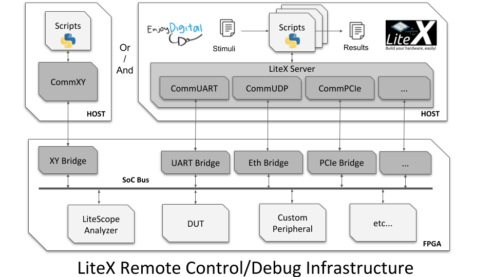

# Dahlia Cookbook

This repo contains examples of using [Dahlia](https://github.com/cucapra/dahlia) for making accelerators. Some of the examples are direct port from [Vitis Tutorials](https://github.com/Xilinx/Vitis-Tutorials).

**Note:** There are some changes made to the source code of Dahlia. https://github.com/mark1626/dahlia

## Examples

1. [Travelling Salesperson](./travelling-salesperson/README.md)
2. [Lorenz ODE Solver using Runge Kutta](./lorenz/README.md)
3. [Fixed Point Variant of the Lorenz ODE Solver](./lorenz-fp/README.md)
4. [Mandelbrot set in hardware](./mandelbrot/README.md)
5. [Abelian Sandpile Model](./sandpile-stabilizer/README.md)
6. [xxtea](./xxtea/README.md)

## Running on FPGA boards

Some of the examples have been run on FPGAs. Two possible options were explored.

### Litex SoC

[LiteX](https://github.com/enjoy-digital/litex/) framework provides an infrastructure to create FPGA SoCs. The exported Verilog of the accelerator was added as custom module into a Litex SoC. In order to communicate from host to the FPGA, a bridge is added in the SoC. This could be through UART, Ethernet or PCIe

A typical flow would be

1. SoC design with the accelerator was synthesized and flashed to the FPGA
2. A connection to the on-board bridge is created with Litex Server
3. From the host machine a script can run and use the accelerator

The design would be like this

> **Image Credit: [Litex, Litex Wiki](https://github.com/enjoy-digital/litex/wiki/Use-Host-Bridge-to-control-debug-a-SoC)**

### Xilinx - DMA for PCI Express (PCIe) Subsystem

A much high throughput would be to use the DMA for PCI Express (PCIe) Subsystem. The accelerator could be expored as a Vivado IP and can be added in the design along with the DMA subsystems.

This could be used in boards like Nitefury II or Xilinx Ultrascale+ boards

## TODO

- Add an example with a data shuffle
- Maybe this [kmeans example?](https://github.com/Xilinx/Vitis_Accel_Examples/blob/f61637e9263ecc1be3df34182ea6c53a0ca10447/demo/kmeans/src/krnl_kmeans.cpp)
- Have a common Makefile from which each example will inherit rules
- Add a Nitefury II Example
