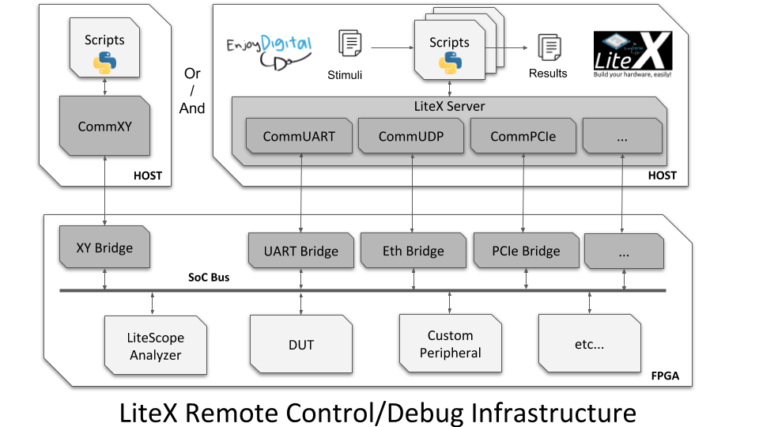

# Dahlia Cookbook

This repo contains examples of using [Dahlia](https://github.com/cucapra/dahlia) for making accelerators. Some of the examples are direct port from [Vitis Tutorials](https://github.com/Xilinx/Vitis-Tutorials).

**Note:** There are some changes made to the source code of Dahlia. https://github.com/mark1626/dahlia

## Examples

1. [Travelling Salesperson](./travelling-salesperson/README.md)
2. [Lorenz ODE Solver using Runge Kutta](./lorenz/README.md)
3. [Fixed Point Variant of the Lorenz ODE Solver](./lorenz-fp/README.md)
4. [Mandelbrot set in hardware](./mandelbrot/README.md)
5. [Sandpile Stabilizer](./sandpile-stabilizer/README.md)

## Litex SoC design

LiteX framework provides an efficient infrastructure to create FPGA SoCs. We can add our custom modules into the SoC. Litex Server is going to act as a host. In order to communicate with the FPGA we need a bridge added to the SoC. It could be done in multiple ways, like using UART, Ethernet or PCIe. 

## TODO

- Add an example with a data shuffle
- Maybe this [kmeans example?](https://github.com/Xilinx/Vitis_Accel_Examples/blob/f61637e9263ecc1be3df34182ea6c53a0ca10447/demo/kmeans/src/krnl_kmeans.cpp)
- Have a common Makefile from which each example will inherit rules
