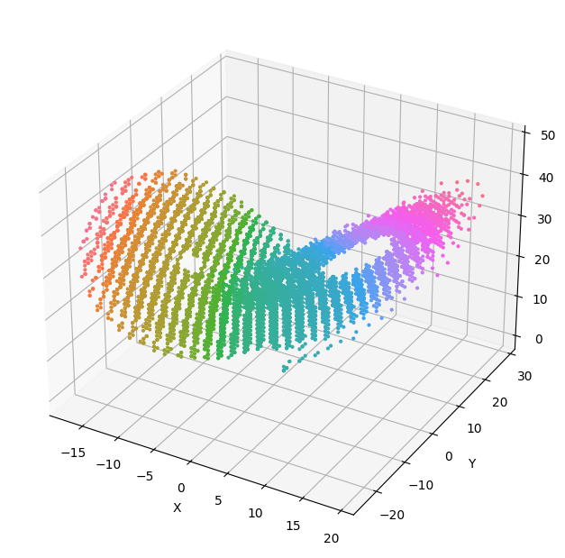

# lorenz ODE Solver Fixed Point

Using a second order RK for now

Reference for Runge Kutta `Numerical Recipes in C - The Art of Scientific Computing`

This has been run on Vitis HLS 2022.2

|                      |          Status         |
|----------------------|-------------------------|
| Implementation       | Done                    |
| CSim                 | Working                 |
| Synth                | Working                 |
| CoSim                | Working                 |
| Artix7               |                         |
| Ultrascale or AWS F1 |                         |

## Building and testing

The build_hls.tcl script can create a HLS project and run csim, synthesis and cosim.

The `Makefile` has a rule to create the HLS code from the Dahlia and call Vitis HLS with the `build_hls.tcl` script.

```
make synthesis
```

The test bench writes the points into a csv file, this can be plotted using the python script in the same directory. It should give something like this.

```
python plot.py
```



## Report

### Synthesis

```
    * Version:        2022.2 (Build 3670227 on Oct 13 2022)
    * Project:        lorenz_prj
    * Solution:       solution (Vivado IP Flow Target)
    * Product family: virtexuplus
    * Target device:  xcvu37p-fsvh2892-2L-e
    

+ Performance & Resource Estimates: 
    
    PS: '+' for module; 'o' for loop; '*' for dataflow
    +-----------------------------+------+------+---------+-----------+----------+---------+-------+----------+---------+----------+------------+------------+-----+
    |           Modules           | Issue|      | Latency |  Latency  | Iteration|         |  Trip |          |         |          |            |            |     |
    |           & Loops           | Type | Slack| (cycles)|    (ns)   |  Latency | Interval| Count | Pipelined|  BRAM   |    DSP   |     FF     |     LUT    | URAM|
    +-----------------------------+------+------+---------+-----------+----------+---------+-------+----------+---------+----------+------------+------------+-----+
    |+ lorenz                     |     -|  0.00|    98328|  9.833e+05|         -|    98329|      -|        no|  48 (1%)|  40 (~0%)|  2231 (~0%)|  3351 (~0%)|    -|
    | + lorenz_Pipeline_rk_loop   |     -|  0.00|    49153|  4.915e+05|         -|    49153|      -|        no|        -|  40 (~0%)|   673 (~0%)|  1169 (~0%)|    -|
    |  o rk_loop                  |    II|  7.30|    49151|  4.915e+05|         4|        3|  16383|       yes|        -|         -|           -|           -|    -|
    | + lorenz_Pipeline_out_loop  |     -|  0.00|    49155|  4.916e+05|         -|    49155|      -|        no|        -|         -|   120 (~0%)|   174 (~0%)|    -|
    |  o out_loop                 |    II|  7.30|    49153|  4.915e+05|         5|        3|  16384|       yes|        -|         -|           -|           -|    -|
    +-----------------------------+------+------+---------+-----------+----------+---------+-------+----------+---------+----------+------------+------------+-----+

```

### Cosim

```
Solution          : solution.
Simulation tool   : xsim.

+----------+----------+-----------------------------------------------+-----------------------------------------------+----------------------+
|          |          |             Latency(Clock Cycles)             |              Interval(Clock Cycles)           | Total Execution Time |
+   RTL    +  Status  +-----------------------------------------------+-----------------------------------------------+    (Clock Cycles)    +
|          |          |      min      |      avg      |      max      |      min      |      avg      |      max      |                      |
+----------+----------+-----------------------------------------------+-----------------------------------------------+----------------------+
|      VHDL|        NA|             NA|             NA|             NA|             NA|             NA|             NA|                    NA|
|   Verilog|      Pass|         104548|         104548|         104548|             NA|             NA|             NA|                104548|
+----------+----------+-----------------------------------------------+-----------------------------------------------+----------------------+

```
