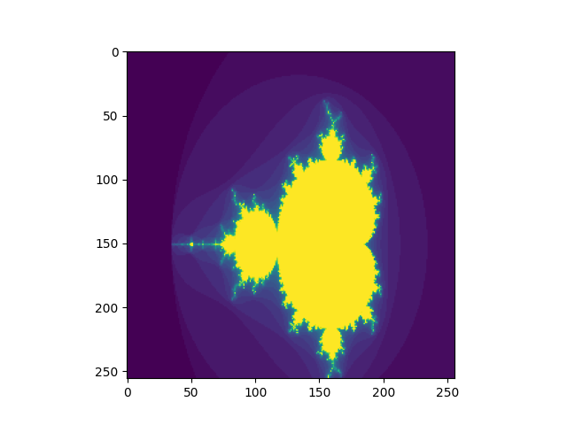

# Mandelbrot set computed from hardware



|                      |          Status         |
|----------------------|-------------------------|
| Implementation       | Done                    |
| Simulation           | Done                    |
| CSim                 | Done                    |
| Synth                | Done                    |
| CoSim                | Done                    |
| Artix7               |                         |
| Ultrascale or AWS F1 |                         |

## Building and testing

To run the cpp functional simulation

```
make mandelbrot.test.cpp
```

This simulation captures the data in the json *actual.json*, this can be plotted using the python script in the same directory.

```
python plot.py
```

---

The build_hls.tcl script can create a HLS project and run csim, synthesis and cosim.

The `Makefile` has a rule to create the HLS code from the Dahlia and call Vitis HLS with the `build_hls.tcl` script.

```
make synthesis
```


## Report

## CSimulation

```
    * Version:        2022.2 (Build 3670227 on Oct 13 2022)
    * Project:        mandelbrot_prj
    * Solution:       solution (Vivado IP Flow Target)
    * Product family: virtexuplus
    * Target device:  xcvu37p-fsvh2892-2L-e
    

+ Performance & Resource Estimates: 
    
    PS: '+' for module; 'o' for loop; '*' for dataflow
    +-----------------------------------------+------+------+---------+-----------+----------+---------+------+----------+---------+----------+------------+-------------+-----+
    |                 Modules                 | Issue|      | Latency |  Latency  | Iteration|         | Trip |          |         |          |            |             |     |
    |                 & Loops                 | Type | Slack| (cycles)|    (ns)   |  Latency | Interval| Count| Pipelined|  BRAM   |    DSP   |     FF     |     LUT     | URAM|
    +-----------------------------------------+------+------+---------+-----------+----------+---------+------+----------+---------+----------+------------+-------------+-----+
    |+ mandelbrot                             |     -|  0.00|   141576|  1.416e+06|         -|   141577|     -|        no|  4 (~0%)|  280 (3%)|  5823 (~0%)|   13737 (1%)|    -|
    | o VITIS_LOOP_50_1                       |     -|  7.30|    74752|  7.475e+05|       292|        -|   256|        no|        -|         -|           -|            -|    -|
    |  + mandelbrot_Pipeline_VITIS_LOOP_53_2  |     -|  0.18|      288|  2.880e+03|         -|      288|     -|        no|        -|  275 (3%)|  4460 (~0%)|  11934 (~0%)|    -|
    |   o VITIS_LOOP_53_2                     |     -|  7.30|      286|  2.860e+03|        32|        1|   256|       yes|        -|         -|           -|            -|    -|
    | o VITIS_LOOP_77_4                       |     -|  7.30|    66816|  6.682e+05|       261|        -|   256|        no|        -|         -|           -|            -|    -|
    |  + mandelbrot_Pipeline_VITIS_LOOP_80_5  |     -|  0.00|      259|  2.590e+03|         -|      259|     -|        no|        -|         -|    20 (~0%)|     99 (~0%)|    -|
    |   o VITIS_LOOP_80_5                     |     -|  7.30|      257|  2.570e+03|         3|        1|   256|       yes|        -|         -|           -|            -|    -|
    +-----------------------------------------+------+------+---------+-----------+----------+---------+------+----------+---------+----------+------------+-------------+-----+
```

## CoSim

```
Solution          : solution.
Simulation tool   : xsim.

+----------+----------+-----------------------------------------------+-----------------------------------------------+----------------------+
|          |          |             Latency(Clock Cycles)             |              Interval(Clock Cycles)           | Total Execution Time |
+   RTL    +  Status  +-----------------------------------------------+-----------------------------------------------+    (Clock Cycles)    +
|          |          |      min      |      avg      |      max      |      min      |      avg      |      max      |                      |
+----------+----------+-----------------------------------------------+-----------------------------------------------+----------------------+
|      VHDL|        NA|             NA|             NA|             NA|             NA|             NA|             NA|                    NA|
|   Verilog|      Pass|         140641|         140641|         140641|             NA|             NA|             NA|                140641|
+----------+----------+-----------------------------------------------+-----------------------------------------------+----------------------+

```
