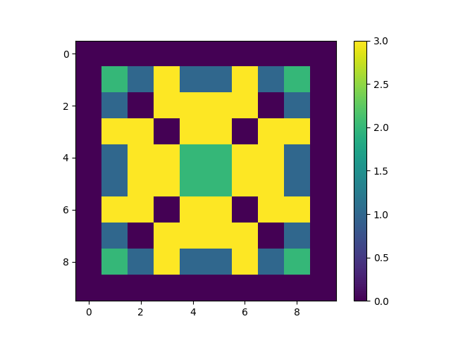

# Sandpile stabilizer computed from hardware



|                      |          Status         |
|----------------------|-------------------------|
| Implementation       | Done                    |
| Simulation           | Done                    |
| CSim                 | Done                    |
| Synth                | Done                    |
| CoSim                | Done                    |
| Artix7               | Done                    |
| Ultrascale or AWS F1 |                         |

## Building and testing

To run the cpp functional simulation

```
make sandpile.test.cpp
```

This simulation captures the data in the json *actual.json*, this can be plotted using the python script in the same directory.

```
python plot.py
```

---

The build_hls.tcl script can create a HLS project and run csim, synthesis and cosim.

The `Makefile` has a rule to create the HLS code from the Dahlia and call Vitis HLS with the `build_hls.tcl` script.

```
make synthesis
```
---

To accelerate the design in Arty A7 board, run the `base.py` which adds our design as a submodule into the SoC. Build and load the FPGA board.


```
python3 base.py --build --load --uart-name=crossover+uartbone --with-analyzer --csr-csv=csr.csv
```
Start the litex server to communicate with the board via UART.
```
litex_server --uart --uart-port=/dev/ttyUSB1
```
To trace the waveform, start the litex scope and set the trigger on a specific signal.
```
litescope_cli -r m_axi_aw_valid
```
Run the test file to start the accelerator and check the results.
```
python3 run_acc.py
```

## Report
